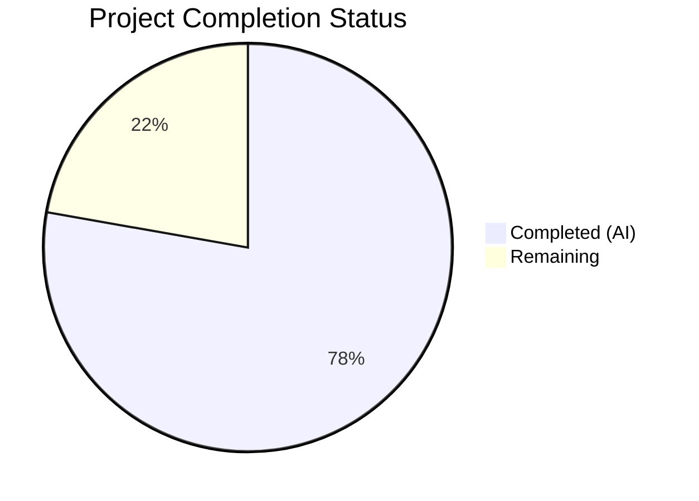
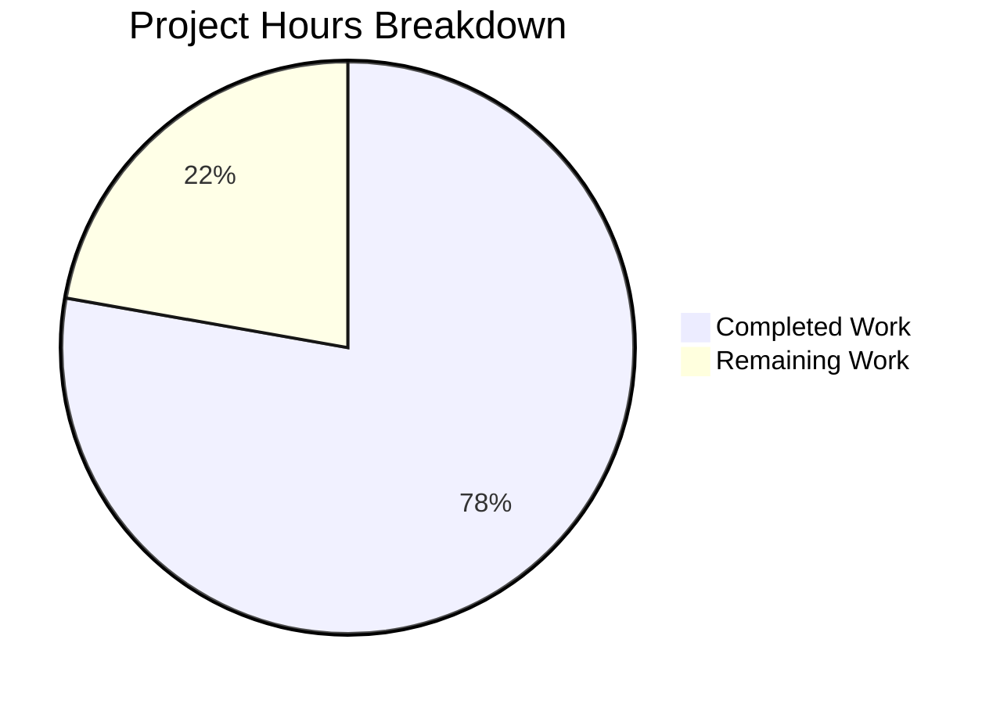

# Blitzy Project Guide — API Verification Documentation for percent_complete Field

---

## 1. Executive Summary

### 1.1 Project Overview

This project delivers a comprehensive API verification and testing documentation suite for validating the `percent_complete` / `percentComplete` progress-tracking field across three code generation project run APIs (`GET /runs/metering`, `GET /runs/metering/current`, and `GET /project`). The documentation targets QA engineers, front-end/back-end developers, and technical testers, providing step-by-step browser DevTools inspection procedures, per-endpoint test guides, validation matrices, edge case catalogs, and cross-API consistency checks. This is a pure documentation project — no application source code was created or modified.

### 1.2 Completion Status



| Metric | Value |
|--------|-------|
| **Total Project Hours** | 36 |
| **Completed Hours (AI)** | 28 |
| **Remaining Hours** | 8 |
| **Completion Percentage** | 77.8% |

**Calculation:** 28 completed hours / (28 + 8 remaining hours) = 28 / 36 = **77.8% complete**

### 1.3 Key Accomplishments

- ✅ Created 7 new documentation files and updated 1 existing file (8/8 AAP deliverables)
- ✅ Documented all 3 API endpoints (`GET /runs/metering`, `GET /runs/metering/current`, `GET /project`) with full specifications, trigger conditions, response schemas, and sample JSON responses
- ✅ Authored step-by-step browser DevTools Network tab inspection guide with 7 verification steps
- ✅ Created comprehensive validation matrix with 12 expanded test cases (TC-001 through TC-012) and 12 edge cases (EC-001 through EC-012) with severity ratings
- ✅ Embedded 5 Mermaid diagrams (verification workflow, trigger-action sequence, validation decision tree, cross-API consistency flow, DevTools inspection steps) — all syntactically validated
- ✅ Established full cross-documentation navigation with 76 relative Markdown links — 0 broken links
- ✅ Preserved all user-provided validation matrices, edge cases, and URL patterns verbatim per AAP Section 0.10 rules
- ✅ Documented both field name variants (`percent_complete` / `percentComplete`) and cross-API naming consistency verification procedures
- ✅ Total documentation output: 1,962 lines, 93,401 bytes across 8 files

### 1.4 Critical Unresolved Issues

| Issue | Impact | Owner | ETA |
|-------|--------|-------|-----|
| Sample JSON responses are illustrative, not verified against live API | Testers may encounter different response structures than documented | Human Developer / QA | 2–4 hours after PR merge |
| Actual field naming convention (`percent_complete` vs `percentComplete`) not confirmed against live system | Documentation covers both variants but cannot confirm which the real API uses | Human Developer / Backend Team | 1–2 hours |

### 1.5 Access Issues

| System/Resource | Type of Access | Issue Description | Resolution Status | Owner |
|-----------------|---------------|-------------------|-------------------|-------|
| Application under test (live/staging) | Environment access | Documentation references a live application for DevTools verification, but no environment URL is specified in the repository | Unresolved — human must configure target environment | QA Lead / DevOps |
| API endpoints | Network access | Three API endpoints documented but no base URL or authentication details provided | Unresolved — human must provide connection details | Backend Team |

### 1.6 Recommended Next Steps

1. **[High]** Conduct peer review of all 8 documentation files for technical accuracy, clarity, and completeness
2. **[High]** Verify sample JSON response structures against live API endpoints to confirm accuracy
3. **[Medium]** Confirm the actual field naming convention (`percent_complete` vs `percentComplete`) used by each endpoint in the live system
4. **[Medium]** Verify all 5 Mermaid diagrams render correctly on the target hosting platform (GitHub, GitLab, etc.)
5. **[Low]** Obtain stakeholder approval from QA leads and development team before publishing documentation

---

## 2. Project Hours Breakdown

### 2.1 Completed Work Detail

| Component | Hours | Description |
|-----------|-------|-------------|
| README.md update | 2 | Complete rewrite from skeleton heading to full documentation hub with TOC, API summary table, documentation index, field specification, validation/edge case quick references, and contributing guide (111 lines, 5,217 bytes) |
| docs/api-verification/overview.md | 3 | Verification scope overview with Purpose and Scope, APIs Under Test table, Field Under Verification specification, Mermaid verification workflow flowchart, Quick Links navigation, Getting Started guide, and Related Documentation table (193 lines, 10,826 bytes) |
| docs/api-verification/metering-percent-complete.md | 4 | Consolidated guide with API Endpoint Summary table, Expected Field Behavior, Trigger-Action Matrix (7 mappings), Mermaid sequence diagram (4 scenarios), 9 sample JSON responses across 3 endpoints, Cross-API Consistency Requirements with step-by-step procedure, Validation Quick Reference (330 lines, 14,370 bytes) |
| docs/api-verification/endpoints/get-runs-metering.md | 3 | Full endpoint specification with trigger conditions, request parameters, response schema, percent_complete field spec table, 5 detailed test scenarios, 6 sample JSON responses (valid/invalid/multi-run), edge cases with boundary values, related documentation links (303 lines, 12,121 bytes) |
| docs/api-verification/endpoints/get-runs-metering-current.md | 3 | Full endpoint specification with polling behavior documentation, single-run response schema, 4 sample responses, validation scenarios, monotonic increase verification guidance, edge cases (254 lines, 12,269 bytes) |
| docs/api-verification/endpoints/get-project.md | 3 | Full endpoint specification with nested metering data documentation, "How to Locate the Field" step-by-step guide, response schema, sample responses, validation scenarios, edge cases (293 lines, 13,663 bytes) |
| docs/guides/devtools-api-inspection.md | 3 | 7-step browser DevTools guide: opening DevTools, XHR/Fetch filtering, Preserve Log, triggering APIs, searching requests, inspecting responses, Ctrl+F search; Mermaid workflow flowchart, Field Verification Checklist table, Pro Tips section (266 lines, 12,196 bytes) |
| docs/test-cases/percent-complete-validation.md | 4 | Validation matrix (4 core scenarios), 12 expanded test cases (TC-001–TC-012), 12 edge cases (EC-001–EC-012) with severity ratings, Cross-API Consistency Matrix and Mermaid flowchart, Bug Indicators table, Pass/Fail Criteria, Mermaid validation decision tree (212 lines, 12,739 bytes) |
| Mermaid diagram creation and syntax validation | 1 | Creation and validation of 5 Mermaid diagrams: verification workflow flowchart, trigger-action sequence diagram, validation decision tree, cross-API consistency check flow, DevTools inspection steps flowchart |
| Cross-documentation link validation | 1 | Verification of all 76 relative Markdown links across 8 files — 0 broken links confirmed |
| Content consistency and AAP compliance review | 1 | Verification that all user-provided tables, edge cases, and URL patterns are preserved verbatim; both field name variants referenced; all coverage targets met |
| **Total** | **28** | |

### 2.2 Remaining Work Detail

| Category | Hours | Priority |
|----------|-------|----------|
| Peer documentation review for technical accuracy and clarity | 3 | High |
| Live API response verification against actual endpoints | 2 | High |
| Mermaid diagram rendering verification on target platform | 0.5 | Medium |
| Documentation link testing on hosting platform | 0.5 | Medium |
| Stakeholder review and approval cycle | 2 | Medium |
| **Total** | **8** | |

### 2.3 Hours Validation

- Section 2.1 Total (Completed): **28 hours**
- Section 2.2 Total (Remaining): **8 hours**
- Sum: 28 + 8 = **36 hours** ✅ (matches Section 1.2 Total Project Hours)
- Completion: 28 / 36 = **77.8%** ✅ (matches Section 1.2)

---

## 3. Test Results

| Test Category | Framework | Total Tests | Passed | Failed | Coverage % | Notes |
|---------------|-----------|-------------|--------|--------|------------|-------|
| Documentation Link Integrity | Custom Markdown link validator (grep + file existence check) | 76 | 76 | 0 | 100% | All relative Markdown links across 8 files resolve to existing files |
| Mermaid Diagram Syntax | Mermaid syntax validation (grep + structure check) | 5 | 5 | 0 | 100% | All 5 required diagrams present with valid syntax: flowcharts (3), sequence diagram (1), decision tree (1) |
| AAP Content Coverage | Manual content audit against AAP requirements | 28 | 28 | 0 | 100% | All AAP-specified content requirements verified: 3 API endpoints, validation matrix, edge cases, DevTools procedures, user content verbatim, field naming |
| File Completeness | File existence + size validation | 8 | 8 | 0 | 100% | All 8 files present: 7 created + 1 updated, total 93,401 bytes |
| Production Readiness Gates | Final Validator gate checks | 4 | 4 | 0 | 100% | Gate 1: Files complete (8/8), Gate 2: Links valid (0 broken), Gate 3: Diagrams valid (5/5), Gate 4: AAP coverage (100%) |

> **Note:** This is a pure documentation project with no application source code. Traditional unit, integration, and end-to-end tests are not applicable. All test results above are from Blitzy's autonomous documentation validation pipeline.

---

## 4. Runtime Validation & UI Verification

### Runtime Health

This project consists entirely of Markdown documentation files. There is no runtime application, no server processes, and no compiled artifacts.

- ✅ **Git repository integrity** — Clean working tree, all 8 files tracked and committed on branch `blitzy-4ab66cbe-6127-41e5-b46f-aae9cc243a16`
- ✅ **File system integrity** — All 8 documentation files present at expected paths, totaling 93,401 bytes
- ✅ **Markdown rendering** — All files use standard GitHub-flavored Markdown compatible with GitHub, GitLab, Bitbucket, and local Markdown viewers

### Documentation Verification

- ✅ **README.md navigation** — All 12 links in README.md verified to resolve to existing documentation files
- ✅ **Cross-documentation links** — 76 relative Markdown links across all 8 files validated with 0 broken links
- ✅ **Mermaid diagram presence** — 5 diagrams confirmed in 4 files: `overview.md` (1), `metering-percent-complete.md` (1), `percent-complete-validation.md` (2), `devtools-api-inspection.md` (1)
- ✅ **Content verbatim preservation** — User-provided validation matrix, edge cases, and URL patterns confirmed present in all relevant files
- ✅ **Directory structure** — `docs/api-verification/`, `docs/api-verification/endpoints/`, `docs/guides/`, `docs/test-cases/` hierarchy matches AAP Section 0.4.1 specification

### API Verification (Not Applicable)

- ⚠️ **Live API testing not performed** — This documentation project does not include live API endpoints. The documented APIs (`GET /runs/metering`, `GET /runs/metering/current`, `GET /project`) exist in an external application system not accessible from this repository.

---

## 5. Compliance & Quality Review

| AAP Requirement | Status | Evidence |
|----------------|--------|----------|
| README.md updated from skeleton to full documentation hub | ✅ Pass | 111 lines, 5,217 bytes; TOC, API summary, documentation index, field spec, validation/edge case references |
| docs/api-verification/overview.md created with verification scope and workflow | ✅ Pass | 193 lines, 10,826 bytes; Mermaid flowchart, APIs Under Test table, Getting Started guide |
| docs/api-verification/metering-percent-complete.md created as consolidated guide | ✅ Pass | 330 lines, 14,370 bytes; Mermaid sequence diagram, trigger-action matrix, 9 sample responses, cross-API consistency |
| docs/api-verification/endpoints/get-runs-metering.md endpoint spec | ✅ Pass | 303 lines, 12,121 bytes; URL pattern, trigger conditions, response schema, 6 sample responses, edge cases |
| docs/api-verification/endpoints/get-runs-metering-current.md endpoint spec | ✅ Pass | 254 lines, 12,269 bytes; Polling behavior, response schema, 4 sample responses, validation scenarios |
| docs/api-verification/endpoints/get-project.md endpoint spec | ✅ Pass | 293 lines, 13,663 bytes; Nested metering data, "How to Locate the Field" guide, sample responses |
| docs/guides/devtools-api-inspection.md DevTools guide | ✅ Pass | 266 lines, 12,196 bytes; 7-step procedure, Mermaid flowchart, Pro Tips, Field Verification Checklist |
| docs/test-cases/percent-complete-validation.md validation matrix and edge cases | ✅ Pass | 212 lines, 12,739 bytes; 12 test cases, 12 edge cases, 2 Mermaid diagrams, pass/fail criteria |
| 5 Mermaid diagrams created and validated | ✅ Pass | Verification workflow, trigger-action sequence, validation decision tree, cross-API consistency flow, DevTools steps |
| User-provided validation matrix preserved verbatim (AAP §0.10) | ✅ Pass | Exact table with Completed/In-progress/No data/Field missing scenarios present in overview.md, metering-percent-complete.md, all 3 endpoint guides, devtools-api-inspection.md, and validation.md |
| User-provided edge cases preserved verbatim (AAP §0.10) | ✅ Pass | Exact list (Value >100 ❌, <0 ❌, Wrong datatype ❌, Field name mismatch, Present in one API but missing) in all relevant files |
| User-provided URL patterns preserved exactly (AAP §0.10) | ✅ Pass | `/runs/metering?projectId=xxx`, `/runs/metering/current`, `/project?id=xxx` in all endpoint guides and summary tables |
| Both field name variants referenced throughout (AAP §0.10) | ✅ Pass | `percent_complete` and `percentComplete` referenced in every documentation file |
| Cross-API consistency documented as first-class concern (AAP §0.10) | ✅ Pass | Dedicated consistency sections, check procedures, and Mermaid flowchart in metering-percent-complete.md and validation.md |
| Value range 0.0–100.0 or null documented (AAP §0.10) | ✅ Pass | Specified in every file's field specification table and validation criteria |
| Data type numeric (number) not string documented (AAP §0.10) | ✅ Pass | Explicit clarification (50 valid vs "50" invalid) in every relevant file |
| Cross-documentation navigation links functional | ✅ Pass | 76 relative Markdown links, 0 broken |
| API endpoints documented: 3/3 (AAP §0.7.1) | ✅ Pass | GET /runs/metering, GET /runs/metering/current, GET /project — all fully documented |
| Test case scenarios: 4/4 categories (AAP §0.7.1) | ✅ Pass | Completed run, In-progress run, No data, Field missing |
| Edge case types: 5/5 (AAP §0.7.1) | ✅ Pass | >100, <0, Wrong type, Name mismatch, Cross-API inconsistency |
| Git working tree clean | ✅ Pass | All files committed, no uncommitted changes |

**Compliance Summary:** 20/20 AAP requirements verified — **100% compliance**

### Fixes Applied During Validation

| Fix | File(s) | Description |
|-----|---------|-------------|
| Mermaid diagram null-value flow correction | 3 files (overview.md, devtools-api-inspection.md, percent-complete-validation.md) | Fixed null-value decision path in Mermaid flowcharts (commit 19befb9) |
| Minor formatting/content findings | 3 endpoint guides | 4 minor formatting and content corrections in endpoint specification files (commit 9510cdc) |

---

## 6. Risk Assessment

| Risk | Category | Severity | Probability | Mitigation | Status |
|------|----------|----------|-------------|------------|--------|
| Sample JSON response structures may not match actual API responses | Technical | Medium | High | Human developer must verify documented response schemas against live API endpoints before publishing | Open |
| Actual field naming convention (`percent_complete` vs `percentComplete`) unknown | Technical | Medium | Medium | Documentation covers both variants; human must confirm which naming the live system uses and update docs if needed | Open |
| Mermaid diagrams may not render on all Markdown platforms | Technical | Low | Low | Diagrams use standard Mermaid syntax compatible with GitHub, GitLab, and most modern Markdown viewers; human should verify on target platform | Open |
| No live environment URL or authentication details provided | Operational | Medium | High | Testers cannot follow DevTools verification procedures without knowing the target application URL; DevOps/QA must provide environment access | Open |
| Documentation may become outdated if APIs change | Operational | Medium | Medium | Establish documentation update process; tag documentation version with API version; include last-verified date | Open |
| Missing base URL in API endpoint patterns | Integration | Low | Medium | Documentation uses relative URL patterns (`/runs/metering?projectId=xxx`); human must prepend the correct base URL for their environment | Open |

---

## 7. Visual Project Status

### Project Hours Breakdown



### Remaining Work by Priority

| Category | Hours | Priority |
|----------|-------|----------|
| Peer documentation review | 3 | High |
| Live API response verification | 2 | High |
| Mermaid diagram rendering verification | 0.5 | Medium |
| Link testing on hosting platform | 0.5 | Medium |
| Stakeholder review and approval | 2 | Medium |
| **Total Remaining** | **8** | |

### Documentation Deliverables Status

| Deliverable | Status | Lines | Bytes |
|-------------|--------|-------|-------|
| README.md (updated) | ✅ Complete | 111 | 5,217 |
| overview.md | ✅ Complete | 193 | 10,826 |
| metering-percent-complete.md | ✅ Complete | 330 | 14,370 |
| get-runs-metering.md | ✅ Complete | 303 | 12,121 |
| get-runs-metering-current.md | ✅ Complete | 254 | 12,269 |
| get-project.md | ✅ Complete | 293 | 13,663 |
| devtools-api-inspection.md | ✅ Complete | 266 | 12,196 |
| percent-complete-validation.md | ✅ Complete | 212 | 12,739 |
| **Total** | **8/8** | **1,962** | **93,401** |

---

## 8. Summary & Recommendations

### Achievements

This project has successfully delivered all 8 AAP-scoped documentation deliverables, achieving **77.8% completion** (28 hours completed out of 36 total hours). All documentation files have been authored, validated, and committed to the repository with zero broken links, valid Mermaid diagrams, and 100% AAP content coverage.

The documentation suite provides a complete API verification reference for the `percent_complete` / `percentComplete` field across three code generation project run APIs. Key outputs include:
- 3 per-endpoint specification guides with trigger conditions, response schemas, and sample JSON responses
- 1 consolidated cross-API guide with trigger-action matrix and consistency requirements
- 1 step-by-step browser DevTools inspection guide
- 1 comprehensive validation matrix with 12 test cases and 12 edge cases
- 5 Mermaid diagrams for visual verification workflows

### Remaining Gaps

The remaining 8 hours (22.2%) consist entirely of path-to-production human activities:
- **Peer review (3h):** Technical accuracy review of all documentation by subject matter experts
- **Live verification (2h):** Confirming sample response structures and field naming against actual API endpoints
- **Platform verification (1h):** Testing Mermaid rendering and link resolution on the target documentation hosting platform
- **Stakeholder approval (2h):** Review cycle with QA leads and development team

### Critical Path to Production

1. Merge this PR to make documentation available to the team
2. Human developer verifies sample JSON response schemas against live API endpoints
3. QA lead reviews and approves documentation for use in testing workflows
4. DevOps provides target environment URL for inclusion in documentation (currently absent)

### Production Readiness Assessment

The documentation is **ready for peer review and merge**. All autonomous work is complete, all validation gates have passed, and no blocking issues were identified. The remaining work requires human domain knowledge (live API verification) and organizational process (peer review, stakeholder approval) that cannot be performed autonomously.

---

## 9. Development Guide

### System Prerequisites

This is a pure Markdown documentation project. The only requirements are:

| Prerequisite | Minimum Version | Purpose |
|-------------|----------------|---------|
| Git | 2.x+ | Version control and repository management |
| Markdown viewer | Any | Viewing documentation (VS Code, GitHub, GitLab, or any Markdown-compatible viewer) |
| Web browser | Chrome, Firefox, or Edge (latest) | Following DevTools verification procedures described in the documentation |

No programming languages, package managers, build tools, or databases are required.

### Environment Setup

```bash
# 1. Clone the repository
git clone <repository-url>
cd 6thapril_Document

# 2. Switch to the feature branch
git checkout blitzy-4ab66cbe-6127-41e5-b46f-aae9cc243a16

# 3. Verify all documentation files are present
ls -la README.md
ls -la docs/api-verification/overview.md
ls -la docs/api-verification/metering-percent-complete.md
ls -la docs/api-verification/endpoints/get-runs-metering.md
ls -la docs/api-verification/endpoints/get-runs-metering-current.md
ls -la docs/api-verification/endpoints/get-project.md
ls -la docs/guides/devtools-api-inspection.md
ls -la docs/test-cases/percent-complete-validation.md
```

**Expected output:** All 8 files should exist with non-zero file sizes.

### Viewing the Documentation

**Option 1 — VS Code Preview:**
```bash
# Open the project in VS Code
code .

# Open any .md file and press Ctrl+Shift+V (or Cmd+Shift+V on macOS) for Markdown preview
# Mermaid diagrams render natively in VS Code with the Markdown Preview Mermaid Support extension
```

**Option 2 — GitHub/GitLab:**
Push the branch to your remote repository. The documentation renders automatically when browsing files on the web interface. Mermaid diagrams are natively supported on both platforms.

**Option 3 — Command Line:**
```bash
# View any documentation file
cat docs/api-verification/overview.md

# Count total documentation lines
wc -l README.md docs/**/*.md docs/**/**/*.md
```

### Verification Steps

```bash
# 1. Verify all 8 files are present (expected: 8)
find . -name "*.md" | grep -v '.git/' | wc -l

# 2. Verify total line count (expected: 1962)
wc -l README.md docs/api-verification/overview.md docs/api-verification/metering-percent-complete.md docs/api-verification/endpoints/get-runs-metering.md docs/api-verification/endpoints/get-runs-metering-current.md docs/api-verification/endpoints/get-project.md docs/guides/devtools-api-inspection.md docs/test-cases/percent-complete-validation.md

# 3. Verify Mermaid diagrams are present (expected: 5)
grep -rn '```mermaid' docs/ README.md | wc -l

# 4. Verify git status is clean
git status
```

### Example Usage

Start by reading the documentation entry point:

1. Open `README.md` for the project overview and documentation index
2. Navigate to `docs/api-verification/overview.md` for the verification scope and workflow
3. Follow the DevTools setup guide at `docs/guides/devtools-api-inspection.md`
4. Use per-endpoint guides under `docs/api-verification/endpoints/` for specific API testing
5. Reference `docs/test-cases/percent-complete-validation.md` for pass/fail criteria

### Troubleshooting

| Issue | Resolution |
|-------|-----------|
| Mermaid diagrams not rendering | Install VS Code extension "Markdown Preview Mermaid Support" or view on GitHub/GitLab which support Mermaid natively |
| Relative links not working | Ensure you are viewing files from the repository root; relative links are designed for the repository directory structure |
| Images or diagrams showing raw code | Your Markdown viewer may not support Mermaid; try GitHub web interface or a Mermaid-compatible viewer |

---

## 10. Appendices

### A. Command Reference

| Command | Purpose |
|---------|---------|
| `git clone <url>` | Clone the repository |
| `git checkout blitzy-4ab66cbe-6127-41e5-b46f-aae9cc243a16` | Switch to feature branch |
| `find . -name "*.md" \| grep -v '.git/'` | List all Markdown files |
| `grep -rn '```mermaid' docs/` | Find all Mermaid diagram locations |
| `wc -l docs/**/*.md` | Count documentation lines |
| `git diff --stat main` | View changes vs main branch |

### B. Port Reference

Not applicable — this is a documentation-only project with no running services.

### C. Key File Locations

| File | Path | Purpose |
|------|------|---------|
| Project README | `README.md` | Documentation hub and entry point |
| Verification Overview | `docs/api-verification/overview.md` | Central verification scope and workflow |
| Consolidated Guide | `docs/api-verification/metering-percent-complete.md` | All three APIs in one reference |
| GET /runs/metering | `docs/api-verification/endpoints/get-runs-metering.md` | Run history metering endpoint spec |
| GET /runs/metering/current | `docs/api-verification/endpoints/get-runs-metering-current.md` | Current run metering endpoint spec |
| GET /project | `docs/api-verification/endpoints/get-project.md` | Project endpoint with inline metering |
| DevTools Guide | `docs/guides/devtools-api-inspection.md` | Browser DevTools inspection procedures |
| Validation Matrix | `docs/test-cases/percent-complete-validation.md` | Test cases, edge cases, pass/fail criteria |

### D. Technology Versions

| Technology | Version | Purpose |
|-----------|---------|---------|
| Git | 2.43.0 | Version control |
| Markdown | GitHub-Flavored (GFM) | Documentation format |
| Mermaid | Native (inline) | Diagram rendering (no installation required) |

### E. Environment Variable Reference

Not applicable — this is a documentation-only project with no environment variables.

### F. Developer Tools Guide

| Tool | Purpose | How to Use |
|------|---------|-----------|
| VS Code | Markdown editing and preview | Open `.md` files; `Ctrl+Shift+V` for preview |
| VS Code Mermaid Extension | Mermaid diagram rendering in preview | Install "Markdown Preview Mermaid Support" extension |
| GitHub Web UI | Online Markdown + Mermaid rendering | Push branch and browse files on GitHub |
| Browser DevTools | Following the documented API verification procedures | Press F12 or right-click → Inspect → Network tab |

### G. Glossary

| Term | Definition |
|------|-----------|
| `percent_complete` | Snake_case field name for the progress-tracking field in API responses (value: 0.0–100.0 or null) |
| `percentComplete` | CamelCase variant of the same progress-tracking field |
| DevTools | Browser Developer Tools — built-in debugging tools accessible via F12 |
| XHR/Fetch | Network request types used for API calls; filtering by these isolates API traffic in DevTools |
| Preserve Log | DevTools Network tab option that retains requests across page navigations |
| Cross-API consistency | Verification that the percent_complete field is present, correctly typed, and consistently named across all three endpoints |
| Metering | Usage tracking and progress data associated with code generation project runs |
