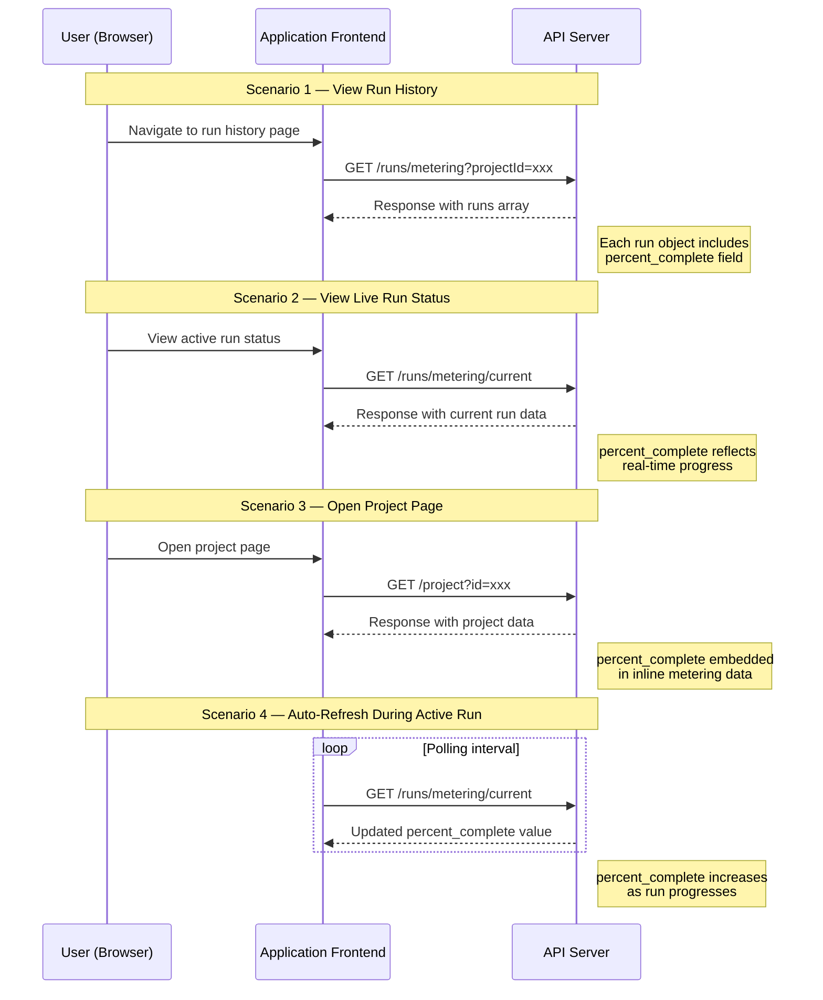

# Consolidated Verification Guide — percent_complete Field

> **Comprehensive guide for verifying the `percent_complete` / `percentComplete` field across all code generation project run APIs**

This is the consolidated verification guide for the `percent_complete` field across three API endpoints related to code generation project runs. The `percent_complete` field is a new progress-tracking field that represents the completion percentage of a code generation run. This guide serves as the single authoritative reference covering all three APIs, their expected behaviors, trigger-action mappings, field naming conventions, cross-API consistency requirements, and sample API responses.

Both naming variants are covered throughout this document:
- **`percent_complete`** — snake_case convention
- **`percentComplete`** — camelCase convention

**Target audience:** QA engineers, front-end developers, back-end developers, and technical testers.

---

## Overview

The `percent_complete` field is a new progress-tracking field added to code generation project run APIs. It represents the completion percentage of a code generation run and appears in three distinct API endpoints, each triggered by different user actions within the application.

**Key field constraints:**
- The field must be **numeric** (number type) — `50` or `50.0` is **VALID**, `"50"` (string) is **INVALID**
- Valid values range from **`0.0` to `100.0` inclusive**, or **`null`** when no data is available
- The field must be present in all three endpoints; absence from any endpoint is a ❌ **bug**

This guide consolidates verification procedures, sample responses, and cross-API consistency checks into a single document. For detailed per-endpoint specifications, refer to the individual endpoint guides linked in the [Related Documentation](#related-documentation) section.

---

## API Endpoint Summary

The following table lists all three API endpoints that include the `percent_complete` / `percentComplete` field:

| # | Endpoint | HTTP Method | URL Pattern | Trigger Conditions | Response Context |
|---|----------|-------------|-------------|--------------------|--------------------|
| 1 | `/runs/metering` | GET | `/runs/metering?projectId=xxx` | Viewing run history, fetching metering data for multiple runs | `percent_complete` appears at the run level, potentially in an array of run objects |
| 2 | `/runs/metering/current` | GET | `/runs/metering/current` | Run currently in progress, viewing live run status, auto-refresh/polling | `percent_complete` reflects real-time progress of the active code generation run |
| 3 | `/project` | GET | `/project?id=xxx` | Opening a project page | `percent_complete` embedded within inline metering data in the project response |

> **Note:** Each endpoint has a dedicated per-endpoint guide with full specification and test procedures. See the links below.

### Per-Endpoint Detail Guides

- [GET /runs/metering — Full Endpoint Guide](endpoints/get-runs-metering.md)
- [GET /runs/metering/current — Full Endpoint Guide](endpoints/get-runs-metering-current.md)
- [GET /project — Full Endpoint Guide](endpoints/get-project.md)

---

## Expected Field Behavior

### Field Specification

| Property | Value |
|----------|-------|
| Field Name (snake_case) | `percent_complete` |
| Field Name (camelCase) | `percentComplete` |
| Data Type | `number` (numeric — integer or float) |
| Valid Range | `0.0` to `100.0` inclusive |
| Null Allowed | Yes — `null` when no data is available |
| Invalid Types | String (`"50"`), Boolean (`true`), Object (`{}`), Array (`[]`) |

### Value Interpretation

| Value | Meaning |
|-------|---------|
| `0.0` | Run has just started, 0% complete |
| Between `0.0` and `100.0` | Run is in progress at the specified percentage |
| `100.0` | Run is fully completed |
| `null` | No progress data available (new project, no runs started, or data not yet populated) |
| Any value < `0.0` | ❌ Bug: out of valid range (below lower bound) |
| Any value > `100.0` | ❌ Bug: out of valid range (exceeds upper bound) |
| Any non-numeric type | ❌ Bug: wrong data type (e.g., `"50"` string is invalid; `50` number is valid) |

> **Data Type Clarification:** The value `"50"` (a string) is **INVALID**, while `50` or `50.0` (a number) is **VALID**. The field must always contain a numeric type — never a string representation of a number.

### Field Naming Conventions

The field may appear as `percent_complete` (snake_case) or `percentComplete` (camelCase) depending on the API's serialization convention. This is an important verification point:

- **Check which naming convention each endpoint uses** — inspect the raw JSON response for each of the three APIs
- **Verify consistency across all endpoints** — the field name should be the same across all three APIs
- If different endpoints use **different naming conventions**, this is a ⚠️ **naming inconsistency** that should be flagged and investigated
- The field name must be **consistent** across all three endpoints — either all use `percent_complete` or all use `percentComplete`

> **Why this matters:** The user requirements explicitly identify `percent_complete` vs `percentComplete` as a potential discrepancy to verify. Inconsistent naming between APIs can cause front-end integration issues and confuse downstream consumers.

---

## Trigger-Action Matrix

Each API endpoint is invoked under different application conditions. The following table maps user actions to the API calls they trigger, helping testers know which actions to perform in order to capture each API request in the Network tab.

| User Action | API Triggered | URL Pattern | When to Expect |
|-------------|---------------|-------------|----------------|
| View run history page | `GET /runs/metering` | `/runs/metering?projectId=xxx` | When navigating to the project's run history or metering dashboard |
| Fetch metering data for multiple runs | `GET /runs/metering` | `/runs/metering?projectId=xxx` | When the application loads metering data for a list of runs |
| Start a code generation run | `GET /runs/metering/current` | `/runs/metering/current` | When a new run begins and the application checks current status |
| View live run status | `GET /runs/metering/current` | `/runs/metering/current` | While a run is in progress and the user is on a status page |
| Auto-refresh / polling during run | `GET /runs/metering/current` | `/runs/metering/current` | Automatically called at intervals during an active run |
| Open a project page | `GET /project` | `/project?id=xxx` | When navigating to or loading a project page |
| Refresh the project dashboard | `GET /project` | `/project?id=xxx` | When the project dashboard page is refreshed |

> **Testing tip:** Before performing any triggering action, ensure your browser DevTools Network tab is open with **Preserve Log** enabled and filtered to **XHR/Fetch** requests. See the [DevTools API Inspection Guide](../guides/devtools-api-inspection.md) for step-by-step instructions.

---

## API Trigger-Action Flow

The following sequence diagram illustrates how user actions trigger API calls and how the `percent_complete` field appears in responses:



---

## Sample API Responses

The following sample JSON responses illustrate where the `percent_complete` field appears in each endpoint's response. Each endpoint includes at minimum a valid response and a null-value scenario.

### GET /runs/metering

**Sample 1 — Completed run** (`percent_complete` = `100.0`):

```json
{
  "projectId": "xxx",
  "runs": [
    {
      "runId": "run-001",
      "status": "completed",
      "percent_complete": 100.0,
      "startedAt": "2024-01-15T10:00:00Z",
      "completedAt": "2024-01-15T10:15:00Z"
    }
  ]
}
```

**Sample 2 — No data / pending run** (`percent_complete` = `null`):

```json
{
  "projectId": "xxx",
  "runs": [
    {
      "runId": "run-002",
      "status": "pending",
      "percent_complete": null,
      "startedAt": "2024-01-15T11:00:00Z",
      "completedAt": null
    }
  ]
}
```

**Sample 3 — In-progress run** (`percent_complete` = `45.5`):

```json
{
  "projectId": "xxx",
  "runs": [
    {
      "runId": "run-003",
      "status": "running",
      "percent_complete": 45.5,
      "startedAt": "2024-01-15T12:00:00Z",
      "completedAt": null
    }
  ]
}
```

### GET /runs/metering/current

**Sample 1 — Active run in progress** (`percent_complete` = `67.3`):

```json
{
  "runId": "run-003",
  "status": "running",
  "percent_complete": 67.3,
  "startedAt": "2024-01-15T12:00:00Z"
}
```

**Sample 2 — No current run** (`percent_complete` = `null`):

```json
{
  "runId": null,
  "status": "idle",
  "percent_complete": null
}
```

### GET /project

**Sample 1 — Project with completed run and inline metering data** (`percent_complete` = `100.0`):

```json
{
  "id": "xxx",
  "name": "My Project",
  "metering": {
    "currentRun": {
      "runId": "run-001",
      "status": "completed",
      "percent_complete": 100.0
    }
  }
}
```

**Sample 2 — Project with no metering data** (`percent_complete` = `null`):

```json
{
  "id": "xxx",
  "name": "My Project",
  "metering": {
    "currentRun": {
      "runId": null,
      "status": "none",
      "percent_complete": null
    }
  }
}
```

> **Note:** These are illustrative sample responses. Actual response structure may vary — the key verification point is the presence, type, and value of the `percent_complete` / `percentComplete` field.

---

## Cross-API Consistency Requirements

The `percent_complete` field must be consistently present and correctly implemented across **all three** endpoints. Cross-API consistency is a first-class verification concern — a field that is present in one API but missing from others is a ❌ **bug**.

### Consistency Checklist

1. **Field Presence:** The field must appear in responses from all three endpoints — not just one or two
2. **Field Naming:** The field name must be the same across all three endpoints (either all `percent_complete` or all `percentComplete`)
3. **Data Type:** The field must be numeric in all three endpoints
4. **Value Range:** All three endpoints must enforce the same `0.0`–`100.0` or `null` range
5. **Logical Consistency:** For the same project/run, the values should be logically consistent across endpoints (e.g., a completed run should show `100.0` in all applicable endpoints)

### How to Verify Cross-API Consistency

Follow this step-by-step procedure to perform a cross-API consistency check:

1. **Trigger all three APIs** for the same project (use the same `projectId`)
2. **Capture** the `percent_complete` / `percentComplete` field value from each response
3. **Compare: Is the field present in all three responses?**
   - If missing from any endpoint → ❌ Bug: field not present in all APIs
4. **Compare: Is the field name the same in all three responses?**
   - If naming differs → ⚠️ Naming inconsistency: `percent_complete` vs `percentComplete`
5. **Compare: Is the data type numeric in all three responses?**
   - If any endpoint returns a string or other non-numeric type → ❌ Bug: wrong data type
6. **Compare: Are the values logically consistent?**
   - A completed run should show `100.0` (or close) across applicable endpoints
   - An in-progress run should show a value less than `100.0` across applicable endpoints
7. **If any discrepancy is found**, flag it as a potential bug and document the details

---

## Validation Quick Reference

### Validation Matrix

| Scenario        | Expected               |
|-----------------|------------------------|
| Completed run   | Value between 0–100    |
| In-progress run | Likely < 100           |
| No data         | null                   |
| Field missing   | ❌ Bug                 |

### Edge Cases

- Field present but:
  - Value > 100 ❌
  - Value < 0 ❌
  - Wrong datatype (string instead of number) ❌
- Field name mismatch (percent_complete vs percentComplete)
- Present in one API but missing in others

### Full Test Cases

For the comprehensive validation matrix with expanded test scenarios, edge case catalog, pass/fail criteria, and decision tree diagrams, see: [Full Validation Matrix & Test Cases](../test-cases/percent-complete-validation.md)

---

## Related Documentation

- [Verification Overview](overview.md) — Scope summary and verification workflow
- [GET /runs/metering — Endpoint Guide](endpoints/get-runs-metering.md) — Detailed endpoint specification and test procedures
- [GET /runs/metering/current — Endpoint Guide](endpoints/get-runs-metering-current.md) — Detailed endpoint specification and test procedures
- [GET /project — Endpoint Guide](endpoints/get-project.md) — Detailed endpoint specification and test procedures
- [DevTools API Inspection Guide](../guides/devtools-api-inspection.md) — Step-by-step browser verification workflow
- [Validation Matrix & Test Cases](../test-cases/percent-complete-validation.md) — Comprehensive test scenarios and pass/fail criteria
