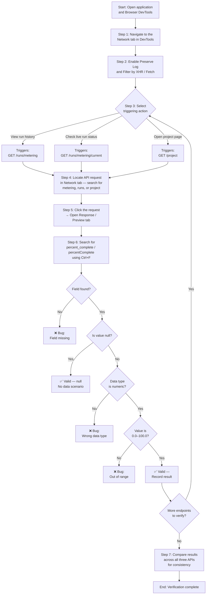

# API Verification Overview — percent_complete Field

> **Central entry point for verifying the `percent_complete` / `percentComplete` field across all code generation project run APIs**

This document provides a comprehensive overview of the verification scope for the `percent_complete` (snake_case) / `percentComplete` (camelCase) field — a new progress-tracking field that represents the completion percentage of code generation project runs. Three API endpoints are under verification to ensure this field is correctly implemented, consistently named, properly typed, and present across all endpoints.

**Target audience:** QA engineers, front-end developers, back-end developers, and technical testers.

---

## Purpose and Scope

The `percent_complete` field has been introduced as a new progress-tracking field for code generation project runs. This documentation provides the verification procedures, validation criteria, and testing guidance for QA engineers, developers, and testers who need to validate the correct implementation of this field.

**What must be verified:**

- **Data type correctness:** The field must be numeric (`number`) — `50` or `50.0` is valid, `"50"` (string) is **INVALID**
- **Value range compliance:** Values must be within `0.0` to `100.0` inclusive, or `null` when no data is available
- **Consistent presence:** The field must appear in all three API endpoints — absence from any endpoint is a bug
- **Naming consistency:** Both naming variants (`percent_complete` and `percentComplete`) must be checked across all endpoints to ensure uniform naming convention usage

---

## APIs Under Test

The following three API endpoints include the `percent_complete` / `percentComplete` field and are the subject of this verification effort:

| # | Endpoint | URL Pattern | Trigger Condition |
|---|----------|-------------|-------------------|
| 1 | `GET /runs/metering` | `/runs/metering?projectId=xxx` | Viewing run history, fetching metering data for multiple runs |
| 2 | `GET /runs/metering/current` | `/runs/metering/current` | Run currently in progress, viewing live run status, auto-refresh/polling |
| 3 | `GET /project` | `/project?id=xxx` | Opening a project page |

### Endpoint Descriptions

- **GET /runs/metering** — Returns metering data for project runs. The `percent_complete` field appears at the run-level within the response array/object. This API is triggered when a user views run history or fetches metering data for multiple runs.

- **GET /runs/metering/current** — Returns metering data for the currently active run. The `percent_complete` field reflects real-time progress during code generation. This endpoint may be called via auto-refresh/polling while a run is in progress.

- **GET /project** — Returns project data with inline metering information. The `percent_complete` field is embedded within nested metering data in the response. This API is triggered when a user opens a project page.

---

## Field Under Verification

### Field Specification

| Property | Value |
|----------|-------|
| **Field Name (snake_case)** | `percent_complete` |
| **Field Name (camelCase)** | `percentComplete` |
| **Data Type** | Numeric (`number`) — NOT string |
| **Valid Range** | `0.0` to `100.0` inclusive |
| **Null Allowed** | Yes — `null` when no data is available |
| **Context** | Code generation project runs |

- **Field names:** `percent_complete` (snake_case) and `percentComplete` (camelCase) — both variants must be checked for consistency across all three endpoints
- **Data type:** Numeric (`number`) — NOT string. Example: `50` or `50.0` is valid, `"50"` (string) is **INVALID**
- **Value range:** `0.0` to `100.0` inclusive, or `null`
- **Null meaning:** `null` indicates no data is available (e.g., new project with no runs, or data not yet populated)
- **Context:** Code generation project runs

### Validation Quick Reference

| Scenario        | Expected               |
|-----------------|------------------------|
| Completed run   | Value between 0–100    |
| In-progress run | Likely < 100           |
| No data         | null                   |
| Field missing   | ❌ Bug                 |

### Edge Cases Quick Reference

- Field present but:
  - Value > 100 ❌
  - Value < 0 ❌
  - Wrong datatype (string instead of number) ❌
- Field name mismatch (percent_complete vs percentComplete)
- Present in one API but missing in others

> **Cross-API consistency is a first-class verification concern.** If the `percent_complete` / `percentComplete` field is present in one API but missing from others, this is a ❌ **bug** and must be reported immediately. See the [Validation Matrix & Test Cases](../test-cases/percent-complete-validation.md) for the full cross-API consistency check procedure.

---

## Verification Workflow

The following Mermaid flowchart illustrates the end-to-end verification workflow for validating the `percent_complete` / `percentComplete` field across all three API endpoints:

**How to read this diagram:**

1. **Start** by opening the application under test and your browser's DevTools (F12 or right-click → Inspect)
2. **Navigate** to the Network tab and set up filters (Preserve Log + XHR/Fetch)
3. **Perform** one of the three triggering actions depending on which API you are testing
4. **Locate** the API request in the Network tab using keyword search
5. **Inspect** the response by clicking the request and opening the Response/Preview tab
6. **Search** for the `percent_complete` or `percentComplete` field using Ctrl+F
7. **Validate** the field: check presence → data type → value range
8. **Repeat** for all three endpoints, then compare results for cross-API consistency

---

## Quick Links

### Per-Endpoint Guides

Detailed specification, trigger conditions, response schema, and endpoint-specific test cases for each API:

- [GET /runs/metering — Endpoint Guide](endpoints/get-runs-metering.md)
- [GET /runs/metering/current — Endpoint Guide](endpoints/get-runs-metering-current.md)
- [GET /project — Endpoint Guide](endpoints/get-project.md)

### Consolidated Guide

All three APIs covered in a single reference with trigger-action matrix, cross-API consistency requirements, and sample responses:

- [Consolidated percent_complete Guide](metering-percent-complete.md)

### Verification Tools

Step-by-step browser-based verification procedures:

- [DevTools API Inspection Guide](../guides/devtools-api-inspection.md) — How to open DevTools, filter Network requests, inspect API responses, and search for the `percent_complete` / `percentComplete` field

### Test Cases

Comprehensive validation scenarios, edge cases, and pass/fail criteria:

- [Validation Matrix & Test Cases](../test-cases/percent-complete-validation.md) — Exhaustive test scenarios including boundary values, type mismatches, naming inconsistencies, and cross-API consistency checks

---

## Getting Started

Follow this numbered workflow to verify the `percent_complete` / `percentComplete` field:

1. **Read this overview** to understand the scope, the three APIs under test, and the end-to-end verification workflow diagram above
2. **Set up your browser DevTools** using the [DevTools API Inspection Guide](../guides/devtools-api-inspection.md) — learn how to open the Network tab, filter by XHR/Fetch, and enable Preserve Log
3. **Follow each per-endpoint guide** to verify the `percent_complete` field for each API:
   - [GET /runs/metering](endpoints/get-runs-metering.md) — trigger by viewing run history
   - [GET /runs/metering/current](endpoints/get-runs-metering-current.md) — trigger by checking live run status
   - [GET /project](endpoints/get-project.md) — trigger by opening a project page
4. **Use the [Validation Matrix](../test-cases/percent-complete-validation.md)** to confirm pass/fail criteria for each scenario (completed run, in-progress run, null data, missing field) and edge case
5. **Perform cross-API consistency checks** to ensure the `percent_complete` / `percentComplete` field is present, correctly typed, properly named, and within valid range across all three endpoints

> **Prerequisite:** Ensure you have access to the application under test with an active project that has code generation runs (at least one completed and/or in-progress run) before beginning verification.

---

## Related Documentation

| Document | Path | Description |
|----------|------|-------------|
| Consolidated Guide | [metering-percent-complete.md](metering-percent-complete.md) | All three APIs, trigger-action matrix, sample responses, cross-API consistency |
| GET /runs/metering | [endpoints/get-runs-metering.md](endpoints/get-runs-metering.md) | Endpoint specification, trigger conditions, response schema, test cases |
| GET /runs/metering/current | [endpoints/get-runs-metering-current.md](endpoints/get-runs-metering-current.md) | Endpoint specification, polling behavior, response schema, test cases |
| GET /project | [endpoints/get-project.md](endpoints/get-project.md) | Endpoint specification, inline metering data, response schema, test cases |
| DevTools Guide | [../guides/devtools-api-inspection.md](../guides/devtools-api-inspection.md) | Step-by-step browser Network tab verification workflow |
| Validation & Test Cases | [../test-cases/percent-complete-validation.md](../test-cases/percent-complete-validation.md) | Validation matrix, edge case catalog, pass/fail criteria, decision trees |
