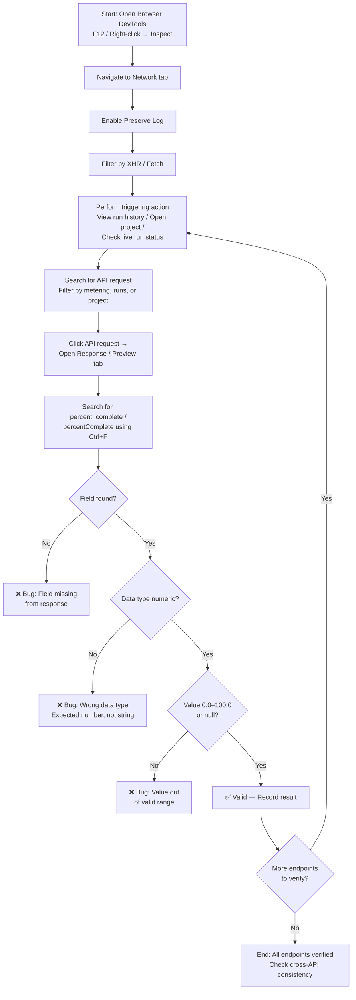

# Browser DevTools — API Inspection Guide

> **Step-by-step guide for verifying the `percent_complete` field using browser DevTools Network tab**

This guide provides practical, browser-based verification procedures for inspecting API responses and validating the `percent_complete` (snake_case) / `percentComplete` (camelCase) field across three API endpoints related to code generation project runs.

**Three endpoints under verification:**

| # | Endpoint | Purpose |
|---|----------|---------|
| 1 | `GET /runs/metering` | Run history and metering data for multiple runs |
| 2 | `GET /runs/metering/current` | Live run status and auto-refresh/polling |
| 3 | `GET /project` | Project data with inline metering information |

No specialized API testing tools are required — only a modern web browser (Chrome, Firefox, or Edge) with built-in Developer Tools.

**Target audience:** QA engineers, front-end developers, back-end developers, and technical testers.

---

## Prerequisites

Before starting the verification process, ensure you have:

- **A modern web browser** — Google Chrome, Mozilla Firefox, or Microsoft Edge recommended
- **Access to the application under test** — the appropriate environment URL (e.g., dev, staging, QA)
- **An active project with code generation runs** — at least one completed and/or in-progress run
- **Sufficient permissions** — a user account that can view projects and run history

---

## Step 1: Open Browser DevTools

Open your browser's Developer Tools using any of these three methods:

1. **Right-click method:** Right-click anywhere on the page → Select **"Inspect"** (or **"Inspect Element"**)
2. **Keyboard shortcut:**
   - Windows / Linux: Press `F12` or `Ctrl+Shift+I`
   - macOS: Press `Cmd+Option+I`
3. **Browser menu:** Click the browser menu (⋮) → **More Tools** → **Developer Tools**

Once DevTools is open, navigate to the **Network** tab in the DevTools panel.

> **Note:** The Network tab is located in the row of tabs at the top of the DevTools panel, alongside Elements, Console, Sources, etc. Click **Network** to switch to it.

---

## Step 2: Filter Requests by XHR / Fetch

By default, the Network tab shows **ALL** requests — HTML documents, CSS stylesheets, JavaScript files, images, fonts, and more. Filtering to XHR/Fetch isolates the API calls you need to inspect.

**Instructions:**

1. In the Network tab toolbar, locate the filter buttons: **All**, **Fetch/XHR**, **JS**, **CSS**, **Img**, etc.
2. Click **Fetch/XHR** (Chrome/Edge) or **XHR** (Firefox) to filter to API requests only
3. The request list now shows only API calls, hiding all non-API traffic

> **Pro Tip:** Always filter by **XHR/Fetch** first to reduce noise and focus on API calls.

---

## Step 3: Enable Preserve Log

Without Preserve Log enabled, the Network tab **clears on every page navigation**. You may lose the API requests you need to inspect if the page navigates away after triggering the API call.

**Instructions:**

1. In the Network tab toolbar, locate the **Preserve log** checkbox
2. Check/enable the **Preserve log** option
3. Requests are now retained even when the page navigates or refreshes

> **Pro Tip:** Enable **Preserve Log** **before** performing any triggering actions so that API requests are captured even if the page navigates away.

---

## Step 4: Trigger the API Calls

Each API endpoint is triggered by specific user actions in the application. The table below maps each endpoint to its URL pattern and the action that triggers it:

| API Endpoint | URL Pattern | Triggering Action |
|-------------|-------------|-------------------|
| `GET /runs/metering` | `/runs/metering?projectId=xxx` | View run history page, fetch metering data for multiple runs |
| `GET /runs/metering/current` | `/runs/metering/current` | Run currently in progress, viewing live run status, auto-refresh/polling |
| `GET /project` | `/project?id=xxx` | Open a project page |

### How to Trigger Each API

- **For `GET /runs/metering`:** Navigate to the project's run history or metering dashboard. The API should appear in the Network tab as a request matching `/runs/metering?projectId=...`.

- **For `GET /runs/metering/current`:** Start a code generation run or navigate to a page showing live run progress. This API may also appear repeatedly via auto-refresh/polling while a run is in progress.

- **For `GET /project`:** Simply open or navigate to a project page. The API call is made automatically when loading project data. Look for a request matching `/project?id=...`.

---

## Step 5: Search for API Requests

Once you have triggered the relevant action, locate the API request in the Network tab:

1. Use the **filter/search bar** at the top of the Network tab
2. Type one of the following keywords to narrow down the results:
   - `metering` — matches both `/runs/metering` and `/runs/metering/current`
   - `runs` — matches all run-related API calls
   - `project` — matches the `/project` endpoint
3. The Network tab will filter to show only requests containing the search term in their URL

> **Note:** You can also scroll through the request list manually and look for requests matching the URL patterns listed in Step 4.

---

## Step 6: Inspect the API Response

After locating the API request in the Network tab, inspect its response:

1. **Click** on the API request in the Network tab request list
2. A detail panel will open (typically on the right side or bottom of the DevTools panel)
3. Navigate to the **Response** tab (shows raw JSON) or **Preview** tab (shows formatted/expandable JSON)
4. The **Preview** tab is recommended for easier navigation of nested JSON structures

> **Note for `GET /project`:** The `percent_complete` / `percentComplete` field may be nested within inline metering data inside the project response. You may need to **expand nested objects** to locate it.

### Example: What to Look For

In the response JSON, you should see the `percent_complete` field within the relevant data object. For example:

```json
{
  "runs": [
    {
      "id": "run-abc-123",
      "status": "completed",
      "percent_complete": 100.0
    }
  ]
}
```

Or within a project response with inline metering:

```json
{
  "project": {
    "id": "project-xyz-789",
    "name": "My Project",
    "metering": {
      "current_run": {
        "percent_complete": 67.5
      }
    }
  }
}
```

---

## Step 7: Search for the percent_complete Field

With the Response or Preview tab open, search for the field within the response body:

1. Press `Ctrl+F` (Windows/Linux) or `Cmd+F` (macOS) to open the in-page search
2. Search for **`percent_complete`** (snake_case variant)
3. If not found, search for **`percentComplete`** (camelCase variant)
4. The search will highlight matching occurrences in the response body

> **Important:** You must search for **both** field name variants. The user requirements explicitly identify naming inconsistency between `percent_complete` and `percentComplete` as a potential issue to verify. If one variant is used in one endpoint and a different variant in another, this is a ⚠️ **naming inconsistency** that should be reported.

### Field Verification Checklist

After locating the field, verify it against these criteria:

| Check | Criteria | Example Valid | Example Invalid |
|-------|----------|---------------|-----------------|
| **Field present?** | Field must exist in the response | `"percent_complete": 75.0` | Field entirely absent → ❌ **Bug** |
| **Data type numeric?** | Value must be a number, NOT a string | `50`, `75.5`, `100.0` | `"50"`, `"75.5"` → ❌ **Bug** |
| **Value in range?** | Must be `0.0`–`100.0` inclusive, or `null` | `0.0`, `50`, `100.0`, `null` | `150.0`, `-5` → ❌ **Bug** |
| **Consistent naming?** | Same field name across all three endpoints | All use `percent_complete` | Mixed naming → ⚠️ **Inconsistency** |

> **Data Type Clarification:** `"50"` (a string) is **INVALID**, while `50` or `50.0` (a number) is **VALID**. The value must always be a numeric type — never a string representation of a number.

---

## Pro Tips

Practical advice for efficient Network tab verification:

- **Enable Preserve Log before triggering actions** — prevents loss of captured requests when the page navigates
- **Filter by XHR/Fetch** — immediately isolates API calls from static asset requests (CSS, JS, images)
- **Use search keywords efficiently:** Type `metering` to match both metering endpoints at once
- **Check multiple responses:** The `GET /runs/metering` endpoint may return an array of runs — verify `percent_complete` in **each item** in the array
- **Watch for polling:** `GET /runs/metering/current` may fire repeatedly via auto-refresh during an active run — check multiple responses to see the value change over time
- **Copy the response:** Right-click on the response and select **"Copy response"** to paste into a text editor for detailed analysis
- **Compare across endpoints:** Trigger all three APIs for the same project and compare the `percent_complete` values for consistency (cross-API verification)

---

## Verification Workflow

The following flowchart illustrates the complete DevTools inspection workflow from start to finish:



---

## Quick Validation Reference

Use this table as a quick reference when evaluating the `percent_complete` / `percentComplete` field:

### Validation Matrix

| Scenario        | Expected               |
|-----------------|------------------------|
| Completed run   | Value between 0–100    |
| In-progress run | Likely < 100           |
| No data         | null                   |
| Field missing   | ❌ Bug                 |

### Edge Cases

- Field present but:
  - Value > 100 ❌
  - Value < 0 ❌
  - Wrong datatype (string instead of number) ❌
- Field name mismatch (percent_complete vs percentComplete)
- Present in one API but missing in others

### Value Range Specification

| Property | Specification |
|----------|--------------|
| Valid Range | `0.0` to `100.0` inclusive |
| Null Allowed | Yes — `null` indicates no data available |
| Data Type | Numeric (`number`) — NOT string |
| Invalid Example | `"50"` (string) ❌ |
| Valid Examples | `50`, `50.0`, `100.0`, `0.0`, `null` ✅ |

---

## Related Documentation

- [Verification Overview](../api-verification/overview.md) — Scope summary and verification workflow
- [Consolidated percent_complete Guide](../api-verification/metering-percent-complete.md) — All three APIs, trigger-action matrix, cross-API consistency
- [GET /runs/metering — Endpoint Guide](../api-verification/endpoints/get-runs-metering.md) — Detailed endpoint specification
- [GET /runs/metering/current — Endpoint Guide](../api-verification/endpoints/get-runs-metering-current.md) — Detailed endpoint specification
- [GET /project — Endpoint Guide](../api-verification/endpoints/get-project.md) — Detailed endpoint specification
- [Validation Matrix & Test Cases](../test-cases/percent-complete-validation.md) — Comprehensive test scenarios and pass/fail criteria
