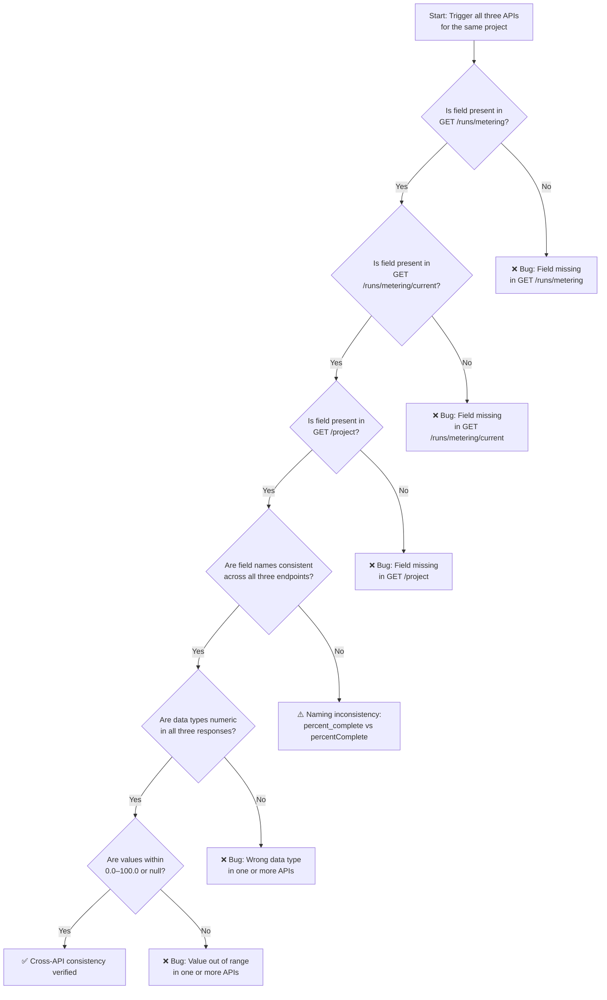
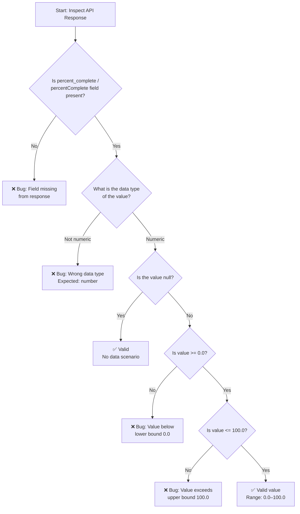

# percent_complete Field — Validation Matrix & Test Cases

This document defines the comprehensive validation criteria, test scenarios, edge cases, and pass/fail definitions for the `percent_complete` (snake_case) / `percentComplete` (camelCase) field. The field tracks the progress of code generation project runs and appears in three API endpoints:

- **`GET /runs/metering`** — Run history and metering data
- **`GET /runs/metering/current`** — Live run status and polling
- **`GET /project`** — Project data with inline metering information

**Target audience:** QA engineers, front-end developers, back-end developers, and technical testers.

---

## Field Specification

| Property | Specification |
|----------|--------------|
| Field Names | `percent_complete` (snake_case), `percentComplete` (camelCase) |
| Data Type | Numeric (`number`) — NOT string |
| Valid Range | `0.0` to `100.0` inclusive |
| Null Allowed | Yes — `null` indicates no data available |
| Context | Code generation project runs |

> **Important:** `"50"` (string) is **INVALID** while `50` or `50.0` (number) is **VALID**. The field value must always be a numeric type, never a string representation of a number.

---

## APIs Under Test

| # | Endpoint | URL Pattern | Trigger Action |
|---|----------|-------------|----------------|
| 1 | `GET /runs/metering` | `/runs/metering?projectId=xxx` | Viewing run history, fetching metering data |
| 2 | `GET /runs/metering/current` | `/runs/metering/current` | Run in progress, live status view, auto-refresh/polling |
| 3 | `GET /project` | `/project?id=xxx` | Opening a project page |

---

## Validation Matrix

The following table defines the core expected outcomes for the `percent_complete` / `percentComplete` field across all scenarios:

| Scenario        | Expected               |
|-----------------|------------------------|
| Completed run   | Value between 0–100    |
| In-progress run | Likely < 100           |
| No data         | null                   |
| Field missing   | ❌ Bug                 |

### Scenario Descriptions

- **Completed run:** The `percent_complete` field should contain a numeric value between `0.0` and `100.0` inclusive. Typically `100.0` for a fully completed run.
- **In-progress run:** The field should contain a numeric value less than `100.0`, representing the current progress percentage. Value increases as the run progresses.
- **No data:** The field should be present but with a `null` value, indicating that progress data is not yet available or not applicable.
- **Field missing:** If the `percent_complete` / `percentComplete` field is entirely absent from the response JSON, this is a ❌ **bug**. The field must always be present in the response.

### Expanded Test Scenarios

| Test ID | Scenario | API Endpoint | Pre-condition | Action | Expected `percent_complete` Value | Pass/Fail |
|---------|----------|-------------|---------------|--------|----------------------------------|-----------|
| TC-001 | Completed run | `GET /runs/metering` | Project has completed code generation runs | View run history | Numeric value `0.0`–`100.0` (typically `100.0`) | ✅ Pass if present and in range |
| TC-002 | Completed run | `GET /runs/metering/current` | No run currently in progress, last run completed | Check current run status | Numeric value `0.0`–`100.0` or `null` | ✅ Pass if present and valid |
| TC-003 | Completed run | `GET /project` | Project page with completed runs | Open project page | Numeric value `0.0`–`100.0` in inline metering data | ✅ Pass if present and in range |
| TC-004 | In-progress run | `GET /runs/metering` | Code generation run is actively running | View run history | Numeric value `< 100.0` | ✅ Pass if present and < 100 |
| TC-005 | In-progress run | `GET /runs/metering/current` | Code generation run is actively running | Check current run status / auto-refresh | Numeric value `< 100.0`, updating over time | ✅ Pass if present and increasing |
| TC-006 | In-progress run | `GET /project` | Project with active code generation run | Open project page | Numeric value `< 100.0` in inline metering data | ✅ Pass if present and < 100 |
| TC-007 | No data | `GET /runs/metering` | Project with no metering data available | View run history | `null` | ✅ Pass if field present and value is `null` |
| TC-008 | No data | `GET /runs/metering/current` | No current run | Check current run status | `null` | ✅ Pass if field present and value is `null` |
| TC-009 | No data | `GET /project` | New project with no runs | Open project page | `null` | ✅ Pass if field present and value is `null` |
| TC-010 | Field missing | `GET /runs/metering` | Any project state | View run history | Field absent from response | ❌ **Bug** |
| TC-011 | Field missing | `GET /runs/metering/current` | Any run state | Check current run status | Field absent from response | ❌ **Bug** |
| TC-012 | Field missing | `GET /project` | Any project | Open project page | Field absent from inline metering data | ❌ **Bug** |

---

## Edge Case Catalog

The following edge cases must be verified for the `percent_complete` / `percentComplete` field:

- Field present but:
  - Value > 100 ❌
  - Value < 0 ❌
  - Wrong datatype (string instead of number) ❌
- Field name mismatch (percent_complete vs percentComplete)
- Present in one API but missing in others

### Edge Case Test Matrix

| Edge Case ID | Condition | Example Value | Expected Result | Severity |
|-------------|-----------|---------------|-----------------|----------|
| EC-001 | Value exceeds upper bound | `150.0` | ❌ Invalid — value must be ≤ 100.0 | High |
| EC-002 | Value exceeds upper bound (boundary) | `100.1` | ❌ Invalid — value must be ≤ 100.0 | High |
| EC-003 | Value below lower bound | `-5.0` | ❌ Invalid — value must be ≥ 0.0 | High |
| EC-004 | Value below lower bound (boundary) | `-0.1` | ❌ Invalid — value must be ≥ 0.0 | High |
| EC-005 | Wrong data type — string | `"75"` | ❌ Invalid — must be numeric, not string | High |
| EC-006 | Wrong data type — boolean | `true` | ❌ Invalid — must be numeric, not boolean | High |
| EC-007 | Wrong data type — object | `{}` | ❌ Invalid — must be numeric, not object | High |
| EC-008 | Field name mismatch | `percent_complete` in one API, `percentComplete` in another | ⚠️ Inconsistency — verify naming convention | Medium |
| EC-009 | Field present in one API but missing in others | Present in `GET /runs/metering` but missing in `GET /project` | ❌ Bug — field must be present in all three endpoints | Critical |
| EC-010 | Exact boundary value — lower | `0.0` | ✅ Valid — lower boundary inclusive | N/A |
| EC-011 | Exact boundary value — upper | `100.0` | ✅ Valid — upper boundary inclusive | N/A |
| EC-012 | Null value | `null` | ✅ Valid — null is allowed when no data available | N/A |

---

## Cross-API Consistency Tests

The `percent_complete` / `percentComplete` field must be consistently present, correctly typed, and properly named across **all three** API endpoints. A field that appears in one API but is missing from another is a ❌ **bug** — cross-API consistency is a first-class verification concern.

### Consistency Check Procedure

1. **Trigger all three APIs** for the same project (same `projectId`)
2. **Verify field presence** — the `percent_complete` / `percentComplete` field must be present in ALL three responses
3. **Verify field name consistency** — the field name must be the same across all three endpoints (either all `percent_complete` or all `percentComplete`)
4. **Verify data type** — the field value must be numeric (`number`) in all three responses
5. **Verify value range** — values must be within `0.0`–`100.0` inclusive, or `null`, in all three responses
6. **Verify logical consistency** — for the same completed run, the values should be logically consistent (e.g., a completed run should show similar values across applicable endpoints)

### Cross-API Consistency Matrix

| Check | GET /runs/metering | GET /runs/metering/current | GET /project | Result |
|-------|-------------------|---------------------------|--------------|--------|
| Field present | ✅ / ❌ | ✅ / ❌ | ✅ / ❌ | All must be ✅ |
| Field name | `percent_complete` or `percentComplete` | Same as above | Same as above | Must be consistent |
| Data type | number | number | number | All must be number |
| Value range | 0.0–100.0 or null | 0.0–100.0 or null | 0.0–100.0 or null | All must comply |

### Cross-API Consistency Check Flow

---

## Bug Indicators

The following conditions indicate a defect in the `percent_complete` / `percentComplete` field implementation:

| Condition | Bug? | Description |
|-----------|------|-------------|
| Field missing from response | ❌ Yes | The `percent_complete` / `percentComplete` field must always be present |
| Value > 100.0 | ❌ Yes | Exceeds valid upper bound |
| Value < 0.0 | ❌ Yes | Below valid lower bound |
| Data type is string | ❌ Yes | Must be numeric (e.g., `50` not `"50"`) |
| Data type is boolean | ❌ Yes | Must be numeric, not `true`/`false` |
| Field name inconsistent across APIs | ⚠️ Investigate | May indicate backend inconsistency; check naming convention |
| Field present in one API but missing in others | ❌ Yes | Must be present in all three endpoints |
| Value is `null` for a completed run | ⚠️ Investigate | Expected for no-data scenarios, but may be a bug for completed runs |

---

## Pass/Fail Criteria

### ✅ PASS Conditions

- Field is present in the API response
- Value is a numeric type (integer or float)
- Value is within range `0.0` to `100.0` inclusive
- Value is `null` when no data is available (e.g., no current run, new project)
- Field name is consistent across all three endpoints

### ❌ FAIL Conditions

- Field is entirely absent from the response
- Value is a non-numeric type (string, boolean, object, array)
- Value exceeds `100.0`
- Value is below `0.0`
- Field is present in one or two APIs but missing from others

---

## Validation Decision Tree

Use the following decision tree to validate the `percent_complete` / `percentComplete` field in any API response:

---

## Related Documentation

- [Verification Overview](../api-verification/overview.md) — Scope summary and verification workflow
- [Consolidated percent_complete Guide](../api-verification/metering-percent-complete.md) — All three APIs, trigger-action matrix, cross-API consistency
- [GET /runs/metering — Endpoint Guide](../api-verification/endpoints/get-runs-metering.md) — Detailed endpoint specification and test procedures
- [GET /runs/metering/current — Endpoint Guide](../api-verification/endpoints/get-runs-metering-current.md) — Detailed endpoint specification and test procedures
- [GET /project — Endpoint Guide](../api-verification/endpoints/get-project.md) — Detailed endpoint specification and test procedures
- [DevTools API Inspection Guide](../guides/devtools-api-inspection.md) — Step-by-step browser verification workflow
